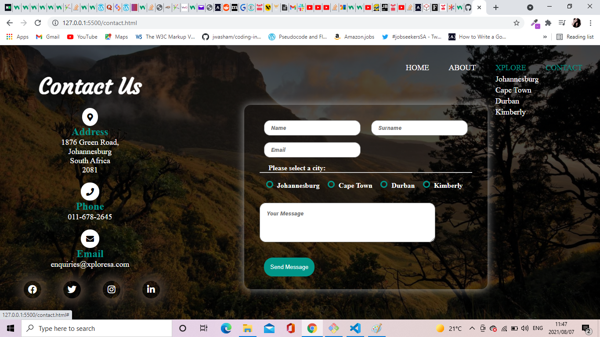

# Xplore-SA-Website
A static website build with HTML, CSS and a bit of Javascript. 

# Technologies Used
* HTML5
* CSS3
* Javascript

# Description
This website was build as my first web development project for Xplore-SA, complete with a Homepage, About, Xplore, and a Contact page. The travel site allows users to discover their favourite cities in South Africa, and learn more about what each of these cities has to offer. 

# How to navigate website

Information on the cities can be accessed by clicking on the images on the homepage, or accessed through the drop down list under Xplore. 

# Screenshots

## [Live Demo Link](https://rawcdn.githack.com/BongekileM/Xplore-SA-Website/83dbdf1e1ab5603549c12b61921e83ac85c11699/index.html)

# Usage

* Clone this repository to your desktop.
* Open the index.html file in your browser. 

# Contributions

Contributions are welcome. To make a contribution:
* Open an issue.
* Fork and clone this repository.
* Send a pull request.

# Authors 
* [Bongekile Mncube](https://github.com/BongekileM)
